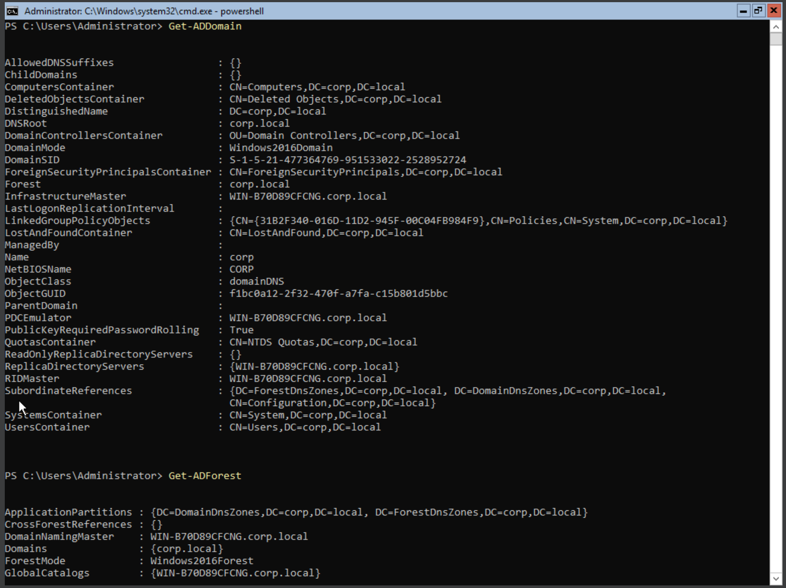
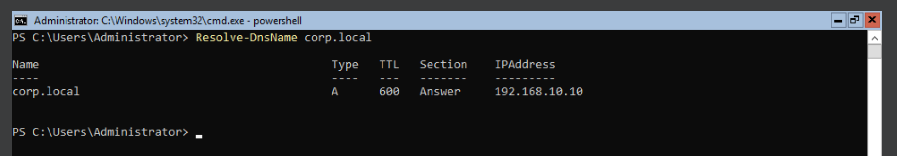

# 🧱 DC01 – Domain Controller Setup

## 🖥️ Base Configuration

| Parameter         | Value                       |
|------------------|-----------------------------|
| Hostname         | `DC01`                      |
| OS               | Windows Server 2019         |
| RAM              | 2 GB                        |
| CPU              | 2 Cores                     |
| Network Adapter  | Internal Network (`ADLabNet`) |
| IP Address       | `192.168.10.10`             |
| Subnet Mask      | `255.255.255.0`             |
| DNS Server       | `127.0.0.1` (local/DNS role) |

---

## ⚙️ Active Directory Setup

- Domain Name: `corp.local`
- Role Installed: `AD-Domain-Services`
- DNS Role: Included during ADDS promotion
- Forest Setup:
  ```powershell
  Install-ADDSForest -DomainName "corp.local"

---

## Verification Commands

# View domain name
(Get-ADDomain).DNSRoot
corp.local


# View forest root domain
(Get-ADForest).RootDomain
corp.local


# Confirm domain controller hostname
(Get-ADDomainController).Name
WIN-B70D89CFCNG
# Confirm DNS is working
Resolve-DnsName corp.local


---

## Notes


- DC01 acts as the first and only Domain Controller in the `corp.local` forest
- This server also handles internal DNS for the AD environment
- Other clients (WIN10, Kali) will point their DNS to `192.168.10.10` to resolve AD services
- This machine will later host AD users, groups, OUs, and be the target for attack scenarios
- SafeModeAdminPassword was configured during `Install-ADDSForest`
- AD Tools (like `Active Directory Users and Computers`) are installed with `-IncludeManagementTools`


---


## 🖼️ Screenshots

<details>
<summary><strong>📟 PowerShell Verification – AD Domain & Forest</strong></summary>



</details>

<details>
<summary><strong>🌐 DNS Resolution – corp.local</strong></summary>



</details>

---

## ⏱️ Time & Progress

| Task                                | Status     | Time Taken |
|-------------------------------------|------------|------------|
| Windows Server Setup                | ✅ Done     | ~20 mins   |
| Configure Static IP, Hostname, DNS | ✅ Done     | ~10 mins   |
| Install AD DS Role                  | ✅ Done     | ~10 mins   |
| Promote to Domain Controller        | ✅ Done     | ~15 mins   |
| Post-Install Verification           | ✅ Done     | ~5 mins    |

> 🧩 **Milestone:** Week 1 – Task 1 Completed  
> 🗂️ **Machine:** DC01 – `corp.local` Domain Controller

