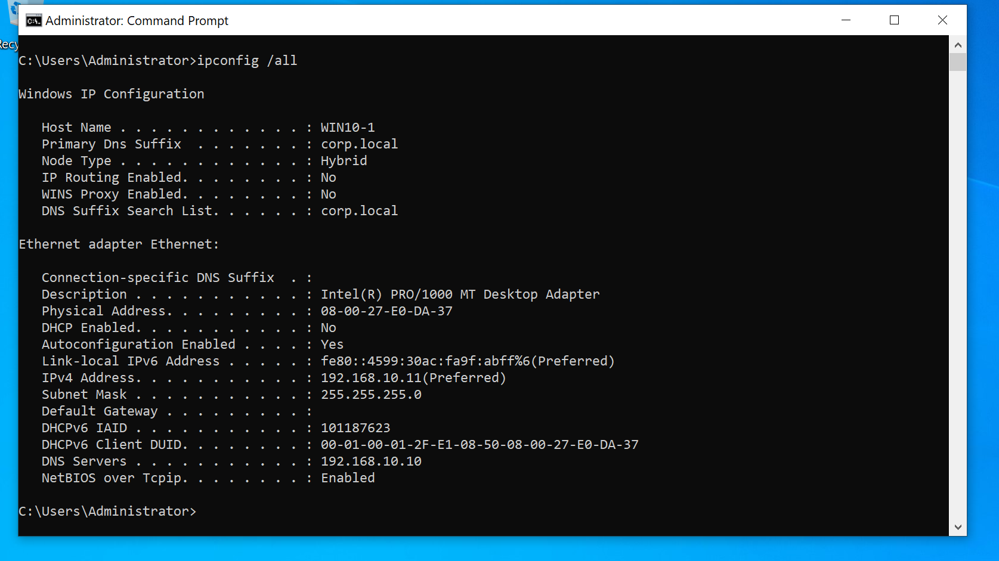
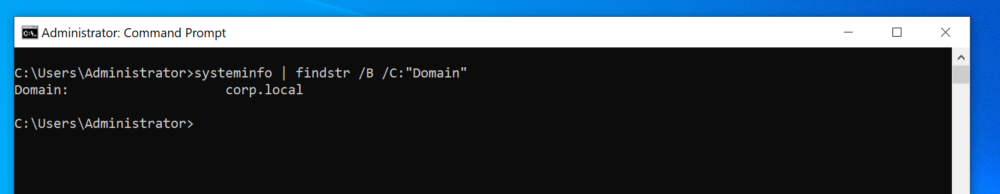

# 🧩 WIN10 – Domain-Joined Client (Windows 10)

This machine simulates a corporate Windows 10 workstation that is domain-joined to `corp.local`. It is configured for use in an Active Directory lab for red teaming, blue teaming, and enterprise-level security testing scenarios.

## 🖥️ System Configuration

| Setting           | Value                      |
|-------------------|----------------------------|
| Hostname          | `WIN10-1`                  |
| OS                | Windows 10                 |
| Domain            | `corp.local`               |
| IP Address        | `192.168.10.11`            |
| Subnet Mask       | `255.255.255.0`            |
| Default Gateway   | `192.168.10.1` *(optional)*|
| DNS Server        | `192.168.10.10` (DC01)     |
| Network Type      | Internal Network (`ADLabNet`) |

## ⚙️ Configuration & Setup

### Rename the Computer

```cmd
wmic computersystem where name="%computername%" call rename name="WIN10-1"
shutdown /r /t 0
```

### Set Static IP & DNS

```cmd
netsh interface ip set address name="Ethernet" static 192.168.10.11 255.255.255.0 192.168.10.1
netsh interface ip set dns name="Ethernet" static 192.168.10.10
```

### Join Domain

1. Run:
   ```cmd
   systempropertiescomputername
   ```
2. Go to **Change Settings** → **Change** → select **Domain** → enter `corp.local`
3. Provide credentials (e.g., `corp\Administrator`)
4. Reboot when prompted

### Post-Join Verification

```cmd
systeminfo | findstr /B /C:"Domain"
whoami
echo %USERDOMAIN%
ping dc01.corp.local
whoami /fqdn
net config workstation
```

## 🔍 Notes

- You are logging into WIN10 locally using a domain account (`corp\Administrator`)
- This is not a Remote Desktop session
- WIN10 does not route traffic through DC01 like a proxy
- DC01 (`192.168.10.10`) functions as a local DNS resolver and Domain Controller
- Internal domain resolution (e.g., `corp.local`) depends on setting DNS to DC01

## 🖼️ Screenshots

<details>
<summary><strong>Static IP & DNS Configuration</strong></summary>

</details>

<details>
<summary><strong>Successful Domain Join</strong></summary>

</details>

<details>
<summary><strong>System Info Output</strong></summary>

</details>

<details>
<summary><strong>Ping DC01 Test</strong></summary>

</details>

## ⏱️ Time Tracking

| Task                              | Status  | Time Taken |
|-----------------------------------|---------|-------------|
| WIN10 Installation                | ✅ Done | ~15 mins    |
| Network Configuration (IP/DNS)    | ✅ Done | ~10 mins    |
| Domain Join Process               | ✅ Done | ~20 mins    |
| Restart & First Login             | ✅ Done | ~5 mins     |
| Domain Connectivity Verification  | ✅ Done | ~10 mins    |
| Screenshot Captures               | ✅ Done | ~10 mins    |
| Final Documentation Update        | ✅ Done | ~15 mins    |

> 📌 **Milestone:** Week 2 – WIN10 domain-joined and fully documented.
